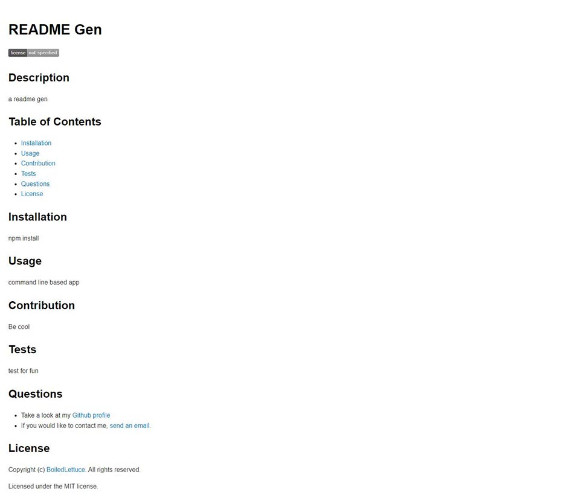

  # README Generator
  

  A command-line based application that generates a quick yet professional README.md file from a users input. This helps save precious time that could be better allocated to developing an application.

  ## Installation

  1. Clone this repository
  2. Node.js should be installed before running this application.
  3. `npm install` required.
  
  ## Usage

  * To invoke this application use the command:

    `node index.js`

  * You will then be prompted with questions to create a pro README.
  
  * Once all prompts have been completed, the README structure should look like:
    * Description
    * Table of Contents
    * Installation
    * Usage
    * Contributions
    * Tests
    * Questions
    * License

    

    

    ## Features

    * Javascript
    * Node.js
    * npm

    ## License

    Copyright (c) BoiledLettuce. All rights reserved.